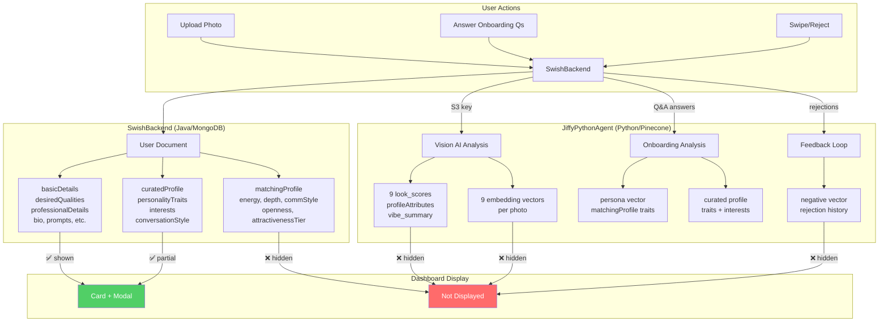

# AI & Matching Fields — What's Populated vs What's Displayed

> Cross-verified inventory of every AI-related field across **SwishBackend**, **JiffyPythonAgent**, and the **JiffyUserDashboard**.

---

## Quick Summary

| Category                       | Total Fields    | Displayed in Dashboard | Not Displayed |
| ------------------------------ | --------------- | ---------------------- | ------------- |
| Curated Profile (AI-generated) | 4               | 3 ✅                   | 1             |
| Matching Profile (AI-derived)  | 6               | 0 ❌                   | **6**         |
| Look Scores (Vision AI)        | 9               | 0 ❌                   | **9**         |
| Photo Attributes (Vision AI)   | 6               | 0 ❌                   | **6**         |
| Embedding Vectors (Pinecone)   | 9 per photo     | 0 ❌                   | **9**         |
| Suggestion Scoring             | 4 per candidate | 0 ❌                   | **4**         |
| Feedback/Rejection Data        | 3 per user      | 0 ❌                   | **3**         |

> [!IMPORTANT]
> Out of **~40+ AI-related fields** that help drive matching, only **3 are displayed** in the dashboard today.

---

## ✅ Currently Displayed in Dashboard

These fields are rendered in the user card and/or the detail modal.

### On the User Card (Grid View)

| Field                                         | Source              | Rendered As                |
| --------------------------------------------- | ------------------- | -------------------------- |
| `curatedProfile.interests`                    | JiffyPythonAgent AI | Interest chips (label `I`) |
| `curatedProfile.conversationStyleDescription` | JiffyPythonAgent AI | Text snippet (label `C`)   |
| `desiredQualities.lookingFor`                 | User input          | Pill badge (label `R`)     |
| `basicDetails.preferredGender`                | User input          | Pill badge (label `G`)     |
| `basicDetails.name`, `age`                    | User input          | Card title                 |
| `professionalDetails` (college)               | User input          | 🎓 line                    |
| `firstImageId`                                | User upload         | Card image                 |

### In the Detail Modal (click a card)

All of the above, plus:
| Field | Source | Section |
|---|---|---|
| `curatedProfile.personalityTraits` | JiffyPythonAgent AI | ✨ Personality Traits |
| `curatedProfile.aboutMe` | SwishBackend | 📖 About Me |
| email, phone, gender | User input | 📋 Basic Information |
| status, verified, profileCompletion | Computed | 📊 Additional Details |
| matchCount, registration date, last login | Backend | 📊 Additional Details |

---

## ❌ NOT Displayed — AI & Matching Fields

### 1. `matchingProfile` (stored in MongoDB, populated by JiffyPythonAgent)

These are derived from the user's Q&A answers by calling `analyze_matching_profile()` with GPT. They directly influence how the suggestion engine scores and ranks candidates.

| Field                      | Type        | Values                      | Used In Matching?                        |
| -------------------------- | ----------- | --------------------------- | ---------------------------------------- |
| `energy`                   | Enum        | `CALM`, `HYPER`, `BALANCED` | ✅ Yes — compatibility scoring           |
| `depthPreference`          | Enum        | `LOW`, `MEDIUM`, `HIGH`     | ✅ Yes — compatibility scoring           |
| `communicationStyle`       | Enum        | `SLOW`, `FAST`, `MIXED`     | ✅ Yes — compatibility scoring           |
| `openness`                 | Double      | 0.0 – 1.0                   | ✅ Yes — compatibility scoring           |
| `attractivenessTier`       | **Integer** | **0 – 10**                  | ✅ Yes — `AttractivenessScoringStrategy` |
| `profileCompletenessScore` | Integer     |                             | Used for filtering                       |

> [!CAUTION]
> `attractivenessTier` is the single most impactful field in suggestion scoring. It's set by the vision AI but **never visible** in the dashboard.

#### How `attractivenessTier` gets populated:

```
User uploads photo → SwishBackend sends S3 key to JiffyPythonAgent
  → Vision AI (OpenAI/Gemini/Claude) analyzes photo
  → Returns `look_scores.overall_look_rating` (0–10)
  → JiffyPythonAgent calls POST /api/internal/analysis-complete
  → SwishBackend saves it as user.matchingProfile.attractivenessTier
```

---

### 2. `look_scores` (stored in Pinecone vector metadata)

Generated by the Vision AI for **each uploaded photo**. These 9 scores are stored as metadata on every embedding vector but never sent to the dashboard.

| Score                     | Scale | Description                           |
| ------------------------- | ----- | ------------------------------------- |
| `facial_attractiveness`   | 0–10  | Perceived facial attractiveness       |
| `approachability`         | 0–10  | How approachable the person looks     |
| `confidence_in_photo`     | 0–10  | Confidence conveyed in the photo      |
| `style_sharedness`        | 0–10  | Fashion/style quality                 |
| `candidness`              | 0–10  | Natural vs staged feel                |
| `expression_charm`        | 0–10  | Expression appeal                     |
| `photo_aesthetic_quality` | 0–10  | Photography/composition quality       |
| `romantic_energy`         | 0–10  | Romantic/flirty vs friendly tone      |
| `overall_look_rating`     | 0–10  | **This becomes `attractivenessTier`** |

Also stored alongside each vector:

- `vibe_summary` — 1-line Gen-Z style comment about the photo
- `look_score_reasoning` — max 2 sentences explaining the rating

---

### 3. `ProfileAttributes` (stored in Pinecone vector metadata)

Extracted by Vision AI per photo:

| Attribute       | Type   | Description                                |
| --------------- | ------ | ------------------------------------------ |
| `gender_guess`  | String | Perceived gender from photo                |
| `age_energy`    | String | Age vibe (e.g., "youthful", "mature")      |
| `fashion_style` | String | Clothing style and aesthetic               |
| `photo_style`   | String | Professional, casual selfie, outdoor, etc. |
| `pose_type`     | String | Relaxed, confident, playful, etc.          |
| `hobby_signals` | List   | Hobby cues from photo                      |

---

### 4. Embedding Vectors (stored in Pinecone)

**Per photo** — 9 semantic embedding vectors across 4 namespaces:

| Vector               | Namespace      | What It Captures                    |
| -------------------- | -------------- | ----------------------------------- |
| `looks_persona`      | persona        | Personality vibe from appearance    |
| `expression`         | persona        | Expression style and charm          |
| `confidence`         | persona        | Confidence cues (pose, composition) |
| `fashion`            | taste          | Fashion/aesthetic meaning           |
| `lighting_aesthetic` | taste          | Color palette, lighting mood        |
| `intent`             | intent         | Dating intent from photo choices    |
| `romantic_energy`    | intent         | Romantic vs friendly tone           |
| `candidness`         | profile_photos | Natural vs staged signals           |
| `overall_vibe`       | profile_photos | Holistic all-signals summary        |

**Per user** — onboarding vectors:

| Vector ID            | What It Stores                                 |
| -------------------- | ---------------------------------------------- |
| `{user_id}`          | Predefined onboarding answers embedding        |
| `{user_id}_dyn`      | Dynamic Q&A answers embedding                  |
| `{user_id}_persona`  | Combined persona (pred + dynamic + rejections) |
| `{user_id}_negative` | Weighted average of rejected users' personas   |

---

### 5. Suggestion Scoring (computed per candidate, stored in `SuggestionCandidate`)

When suggestions are generated, each candidate gets:

| Field                 | Type    | Description                                            |
| --------------------- | ------- | ------------------------------------------------------ |
| `compatibilityScore`  | Integer | From personality/preference matching                   |
| `distanceScore`       | Integer | From GPS proximity                                     |
| `attractivenessScore` | Integer | From tier comparison (`AttractivenessScoringStrategy`) |
| `finalScore`          | Integer | `compatibility + distance + attractiveness`            |
| `matchReason`         | String  | Why this match was suggested                           |
| `distanceKm`          | Double  | Actual distance between users                          |
| `bucket`              | Enum    | Suggestion bucket classification                       |
| `scoreBreakdown`      | Map     | Per-strategy score breakdown                           |

---

### 6. Feedback & Rejection Data (Pinecone + MongoDB)

| Field               | Where Stored                | Description                              |
| ------------------- | --------------------------- | ---------------------------------------- |
| `rejections_json`   | Pinecone (persona metadata) | Last 10 rejection events with timestamps |
| `rejectedUserIds`   | MongoDB                     | List of rejected user IDs                |
| `rejectedByUserIds` | MongoDB                     | List of users who rejected this user     |

Rejections feed into the **negative preference vector** which progressively penalizes similar-looking candidates.

---

### 7. Other User-Input Fields Not Displayed

| Field                                       | Type                   | Potentially Useful?        |
| ------------------------------------------- | ---------------------- | -------------------------- |
| `bio`                                       | String                 | ✅ Could show in modal     |
| `prompts`                                   | Map\<Integer, String\> | ✅ User's prompt responses |
| `questions` / `generatedQuestions`          | List\<String\>         | ℹ️ Onboarding questions    |
| `basicDetails.height`                       | Integer                | ℹ️                         |
| `desiredQualities.socialPersonalityList`    | List\<String\>         | ✅ Social personality tags |
| `desiredQualities.preferredActivitiesList`  | List\<String\>         | ✅ Preferred activities    |
| `desiredQualities.drinkingType`             | String                 | ℹ️                         |
| `desiredQualities.smokerType`               | String                 | ℹ️                         |
| `desiredQualities.idealDate`                | String                 | ✅                         |
| `attractivenessBasicInfo.maxDistance`       | Integer                | ℹ️ Max distance preference |
| `attractivenessBasicInfo.prefferedStartAge` | Integer                | ℹ️ Age range pref          |
| `attractivenessBasicInfo.prefferedEndAge`   | Integer                | ℹ️ Age range pref          |
| `weekendPlans`                              | Object                 | ℹ️                         |
| `dateTiming`                                | Object                 | ℹ️                         |
| `chatCount`                                 | Integer                | ℹ️ Remaining chats         |
| `lastChatReset`                             | Long                   | ℹ️                         |

---

## Data Flow Diagram



---

## Recommendations for Dashboard

Fields that would be **most valuable** to surface per user:

| Priority  | Field                                               | Why                                                                |
| --------- | --------------------------------------------------- | ------------------------------------------------------------------ |
| 🔴 High   | `attractivenessTier`                                | Core to matching — you need visibility into what score AI assigned |
| 🔴 High   | `look_scores` (all 9)                               | Understand how AI perceives each photo                             |
| 🔴 High   | `vibe_summary`                                      | Quick AI-generated first impression per photo                      |
| 🟡 Medium | `energy` / `depthPreference` / `communicationStyle` | See the personality axes AI extracted                              |
| 🟡 Medium | `bio`                                               | Already in MongoDB, just not rendered                              |
| 🟡 Medium | `socialPersonalityList` / `preferredActivitiesList` | Richer profile info                                                |
| 🟢 Low    | `rejectedUserIds` count                             | Understand rejection patterns                                      |
| 🟢 Low    | `chatCount`                                         | See remaining chat credits                                         |
| 🟢 Low    | `scoreBreakdown` per suggestion                     | Understand why matches are made                                    |
